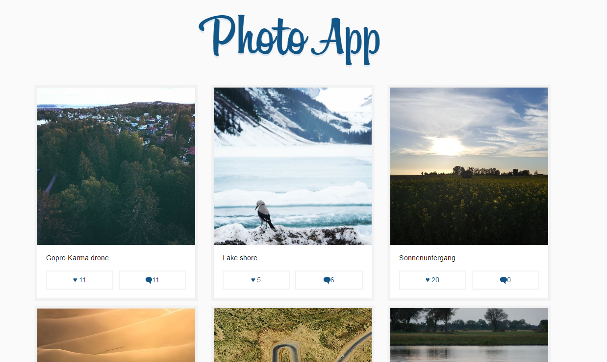

Photo app is a learning app for ReactJS and Redux.




Demo
----
You can find a working example [here](https://ns-ztbdtykalm.now.sh/)

Installation
----
```
npm install
npm start
```

Then open localhost:3000 in your browser.
